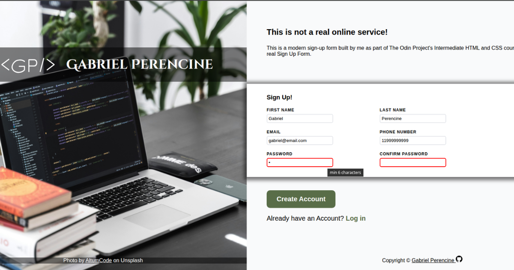

# Sign-up Form

This project is part of the Intermediate HTML and CSS course from **The Odin Project**. In this project, I recreated a modern sign-up form from a provided design using HTML and CSS, focusing on semantic markup, form accessibility, and user experience.

## Design Mockup

The following mockup was provided by **The Odin Project** as the design reference for this project.

## Preview

By completing this project, I demonstrated an understanding of semantic form elements, HTML validation, CSS pseudo-classes, typography, layout techniques, Flexbox, custom fonts, background images, and visual feedback for user interactions. I also strengthened my ability to build accessible and maintainable forms while translating a design mockup into a functional web page.

This project marked an important step in learning modern form design and user interface development, providing valuable experience with HTML forms, CSS styling, and interactive user feedback.